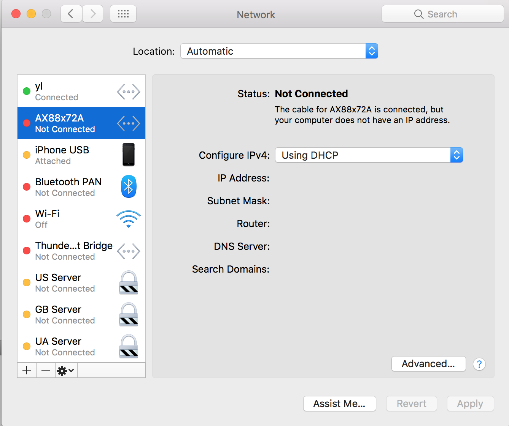

# ssh proxy

`ssh proxy` 是通过包装 `ssh -D` 实现的运行在 `macOS` 上的 `ssh` 代理. 在 `macOS Sierra Version 10.12.5` 上验证通过.

我们通常用的多代理是 shadowsocks, 但是在公司或者客户内部, 我们的 `shadowsocks` 代理通常的都不能用. 因为公司或者客户网络通常对网络端口进行了限制, 而我们买的 `shadowsocks` 账号端口一般都是非 `22`、`443` 端口, 比如：`24060`、`1080`, 这些端口根本就出不去. 所以, 我们可以通过 `ssh proxy` 利用 `22` 号端口将请求代理到外部的 `ssh server` 上, 通过 `ssh server` 向真实的服务发起请求, 最后 `ssh server` 通过该 `ssh` 隧道将请求回复返回给用户.

# 目录结构

```
ssh-proxy/
├── README.md
├── autoproxy.pac # 自动分流脚本
├── config.sh  # 代理配置文件
├── ssh_proxy.sh # 代理启动关闭脚本
└── system_proxy_configure.sh # 系统网络代理配置
```

# 配置

配置在 `config.sh` 中修改, 下面对几个重要的修改项进行了描述.

- socks 代理端口

`127.0.0.1:port`: `ssh proxy` 将创建一个 `socket`, 然后侦听本地的 `port` 端口. `ssh proxy` 通过 `127.0.0.1:port` 将用户请求代理到 `ssh server`.

```
# SOCKS PROXY PORT
# Notes: It's the same value with the autoproxy.pac
PORT=1090
```

默认端口配置为 `1090`.

如果改了默认的端口, 需要同时需要 `autoproxy.pac` 中设置的端口:

```
1 // Generated by gfwlist2pac in precise mode
2 // https://github.com/clowwindy/gfwlist2pac
3 
4 var proxy = "SOCKS5 127.0.0.1:1090; SOCKS 127.0.0.1:1090; DIRECT;";
```

- 代理服务器

`ssh client` 需要连接的 `ssh server` 信息, 包括 `ssh server` 的主机信息和服务端口信息.

```
# user@host
SSH_HOST="username@serverip"
# SSH PORT
SSH_PORT=22
```

`SSH_HOST` 由 `username@serverdomain` 或者 `username@serverip` 组成.

`SSH_PORT` 默认为 `22`, 如果改为其他值, 可能会由于公司或者客户网络防火墙导致代理连不上 `ssh server`.

- interface

这里表示为哪张网卡上的网络请求配置代理服务.



```
# OSX network service to configure proxy for
NET_INTERFACE="yl"
```

- 日志文件

```
# Log file for ssh proxy
LOG_FILE="${HOME}/sshproxy.log"
```

- 不走代理的白名单

```
# Bypass proxy settings for hosts and domains
BYPASS_DOMAINS="127.0.0.1 localhost 169.254/16 192.168/16"
```

# 运行 ssh proxy 代理

```
bash ./ssh_proxy.sh [on|off|status]
```

如果我们通过`密钥`方式连接 `ssh server`, 执行 `ssh_proxy.sh` 启动代理的时候不需要任何交互.

如果我们通过`密码`方式连接 `ssh server`, 执行 `ssh_proxy.sh` 启动代理的时候需要输入用户密码.

# 设置系统网络代理

```
bash ./system_proxy_configure.sh [on|off|status]
```

因为该脚本需要修改`系统网络代理配置`, 所以可能会需要用户输入管理密码.

# Notes

- `ssh_proxy.sh` 和 `system_proxy_configure.sh` 没有严格的先后执行顺序, 前者负责代理程序的管理, 而后者负责系统网络代理的配置.
- 另外，公司或者客户内部我们通常无法使用微信、QQ 等应用，我们可以通过 `Proxifier` 软件解决.


